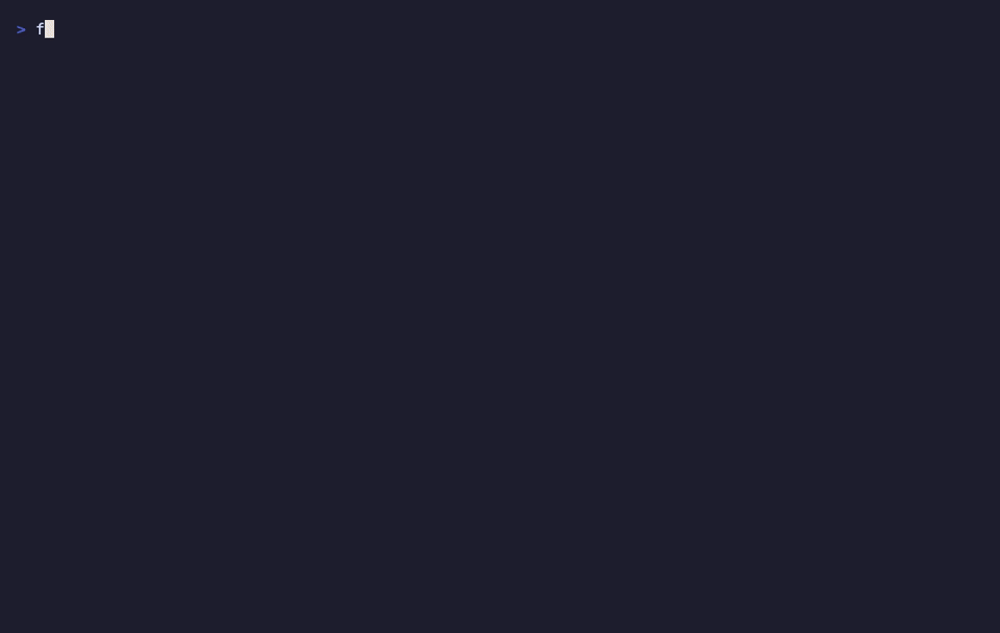
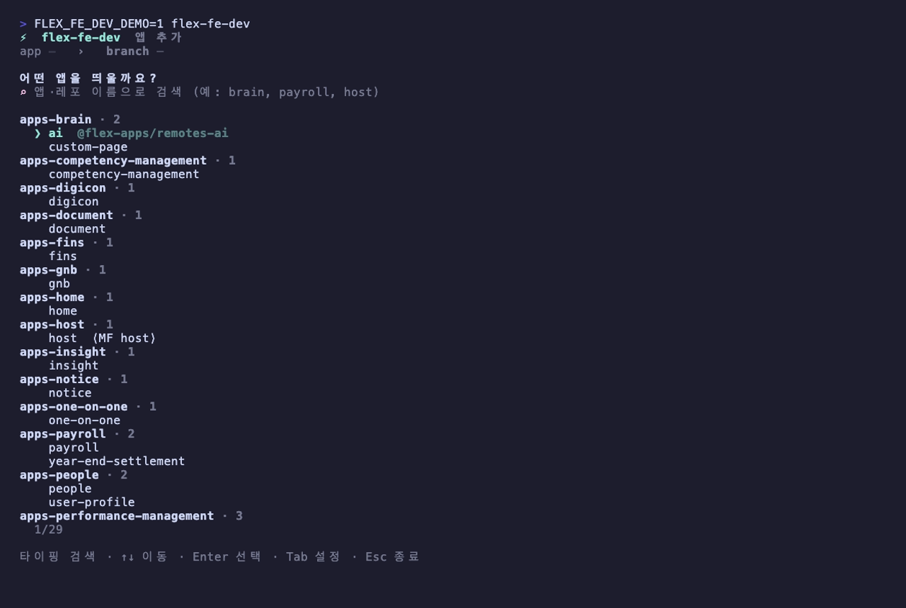
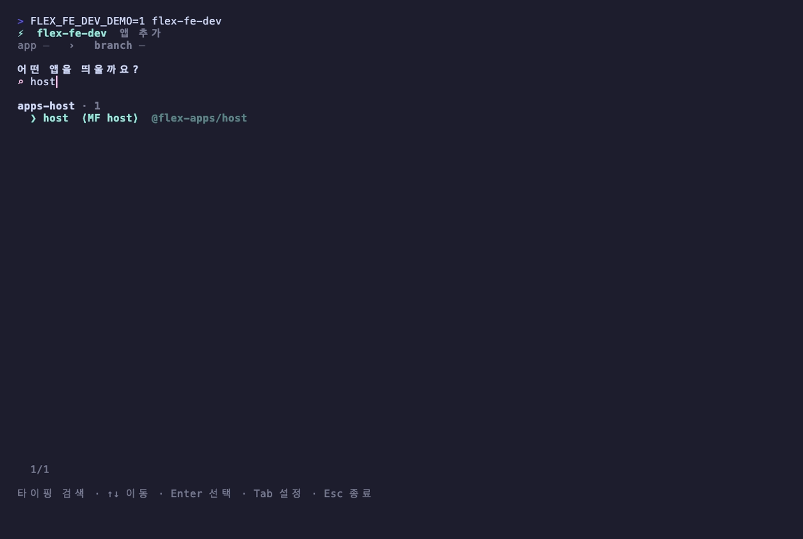
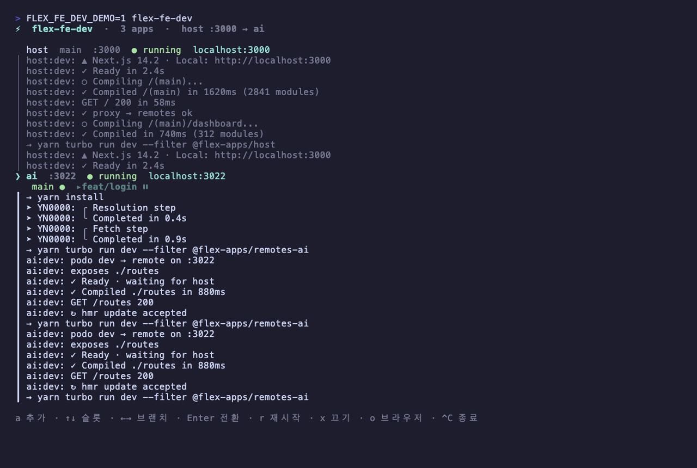

# flex-fe-dev-cli

> **[`flex-frontend-repositories`](https://github.com/flex-team/flex-frontend-repositories) 기반** — 부모 레포 아래 `flex-frontend*` submodule 들이 묶여 있고 각 submodule 에 `web-applications/{remotes-*, host}` 가 있는 모노레포 구조를 전제로 동작한다. 이 레이아웃이 아니면 앱 스캔이 비어 나온다.

flex frontend dev 런처. 작업할 **앱과 브랜치를 고르면** worktree 를 해석/생성하고, dev 서버를 **CLI 내부 대시보드에서 백그라운드로 여러 개 동시에** 띄운다 — host·brain·gnb 를 터미널 탭 3개 대신 한 창에서. 같은 remote 를 여러 브랜치로 등록해 **한 포트에 브랜치를 갈아끼우는 단일-포트 스왑**도 된다. VS Code 로만 열 수도 있다(`open`).

flex 프론트 레포는 부모 레포(`flex-frontend-repositories`) 아래 submodule 들로 묶여 있고, 작업은 각 submodule 의 worktree 에 격리한다. 이 도구는 그 흐름(앱 → 브랜치 → worktree → run/open)을 한 곳에서 처리한다.



## 설치

```bash
git clone git@github.com:flex-hyuntae/flex-fe-dev-cli.git
cd flex-fe-dev-cli
npm install
./install.sh
```

`install.sh` 는 두 가지를 한다:

1. `~/.local/bin` 에 `flex-fe-dev` 를 symlink (PATH 에 없으면 안내).
2. **`FLEX_ROOT` 를 한 번 묻는다** — flex 레포 루트(그 아래 `flex-frontend-repositories` 가 있는 디렉토리). 기본값은 `~/Projects/flex`, 폴더 구조가 다르면 그 자리에서 입력하면 된다. 값은 `~/.config/flex-fe-dev/config.json` 에 저장되며 셸 rc 는 건드리지 않는다. 나중에 바꾸려면 앱 화면에서 `Tab` → 설정으로 변경(저장 즉시 재스캔)하거나, `install.sh` 재실행 / env 오버라이드를 쓴다.

## 사용법 — `flex-fe-dev` (TUI)

```bash
flex-fe-dev
```

계속 떠 있는 대화형 런처. **대시보드**가 메인 화면이고, 여기에 앱을 하나씩 추가해 여러 dev 서버를 동시에 돌린다.

### 1. 앱 추가 — 앱 선택 → 브랜치 → run

대시보드에서 `a` 를 누르면 추가 흐름이 뜬다. 부모 레포 안 모든 submodule 의 `web-applications/{remotes-*, host}` 를 스캔해 **레포(submodule) 단위로 그룹핑**해 보여주고, 타이핑하면 **앱·레포 이름으로 즉시 필터링**된다. `host` 는 MF host 앱(`@flex-apps/host`)으로 다룬다.



타이핑하면 즉시 필터링된다:



앱을 고르고 브랜치를 입력하면 worktree 를 해석한다. **default branch 면 submodule 본체**를 그대로 쓰고, 그 외엔 체크아웃된 worktree 를 찾거나(없으면 origin 에서 자동 생성). 이어서 **run**(대시보드에 추가) 또는 **open**(VS Code 만)을 고른다. run 시 `Space` 로 'VS Code 도 함께 열기'를 토글할 수 있다(기본 켜짐).

### 2. 대시보드 — 분할 로그 + 멀티 supervise

`run` 하면 메뉴가 사라지지 않고 대시보드에 **패널이 추가**되며 그 앱이 백그라운드로 부팅된다(`yarn install` → `.env.local` 보장 → `yarn turbo run dev --filter <workspace>`). 여러 앱을 쌓으면 각 dev 서버 로그가 **분할 패널로 동시에** 흐르고, **focused 슬롯**(`↑↓`/`Tab` 로 이동)이 더 큰 행 비중을 차지한다. 상태는 색으로 구분된다 — `● running`(초록) / `◐ installing`(노랑) / `⏸ parked`(파랑) / `○ exited`(회색) / `✖ failed`(빨강).



focused 슬롯에 대한 키:

- `x` — **끄기**: 그 앱/브랜치를 프로세스 그룹째 종료하고 대시보드에서 제거한다. 개별 종료는 `x` 로 통일 — 터미널 기본 `Ctrl+C` 와 겹치지 않게 한다.
- `r` — 재시작 (in-place — host 가 새 remote 프록시를 반영해야 할 때 사용)
- `o` — 브라우저로 `localhost:<port>` 열기
- `a` — 새 앱 추가 · `←→` — 같은 remote 의 브랜치 탭 이동 · `Enter` — 선택 브랜치로 전환

`Ctrl+C` 는 **flex-fe-dev-cli 자체를 종료**한다. 이때 떠 있는 모든 dev 서버를 정리한다 — SIGTERM(graceful) → 다 죽을 때까지 대기(최대 2초) → 안 죽으면 SIGKILL → 종료. **고아 프로세스/포트 점유가 남지 않는다.**

### 3. 같은 remote 여러 브랜치 — 단일-포트 스왑

같은 remote 를 다른 브랜치로 또 `run` 하면, 포트가 같으므로(예: `ai` = `:3022`) **새 패널을 만들지 않고 그 슬롯의 브랜치 탭으로 추가**된다. 한 번에 **하나만 live**(실제로 포트 점유), 나머지는 `⏸ parked`(정지 — 메모리·포트 0). `←→` 로 브랜치 탭을 고르고 `Enter` 를 누르면 **현재 live 를 정지하고 선택 브랜치를 같은 포트에 올린다**(전환 시 dev 콜드 부팅 대기). host 의 `MF_REMOTES_*_BASE_URL` 은 그 포트로 고정돼 있어 **전환에 host 재시작이 필요 없다**. ([conductor 의 spotlight testing](https://www.conductor.build/docs/reference/scripts/spotlight-testing) 과 유사한, 한 포트에 브랜치를 갈아끼우는 방식.)

remote 를 run 하면 host(:3000) 의 `.env.local` 에서 그 remote 의 `MF_REMOTES_<NAME>_BASE_URL=http://localhost:<port>` 를 자동으로 활성화(주석 해제/없으면 추가)하고, `x` 로 끄면 다시 주석 처리한다. `name`/`port` 는 각 remote 의 `mf.config.ts` 에서 읽는다. **host 는 이 값을 부팅 시점에 읽으므로**, host 가 이미 떠 있는데 새 remote 를 추가하면 대시보드에 "host 재시작 필요" 힌트가 뜬다 → host 패널 focus 후 `r` 로 반영한다.

단축키: 추가 흐름에서 **타이핑 검색** · `↑↓` 이동 · `Enter` 선택 · `Tab` 설정(FLEX_ROOT) · `Space`(run 단계에서 VS Code 열기 토글) · `Esc` 뒤로(추가 흐름→대시보드). 대시보드에서 `a`/`r`/`x`/`o` · `↑↓`/`Tab` focus · `Ctrl+C` 종료(전체).

## 동작 규칙

| 입력 브랜치 | 결과 |
|---|---|
| default branch (예: `main`) | submodule 본체를 그대로 사용 (`/sync` 가 본체를 default 로 정렬하므로 곧 base 형상) |
| 체크아웃된 worktree 가 있는 브랜치 | 그 worktree 경로 |
| origin 에만 있는 브랜치 | `<submodule>/.claude/worktrees/<branch>/` 에 worktree 자동 생성 |
| origin 에도 없는 브랜치 | 에러 |

**host 특수 케이스**: host 는 도메인 remote 가 아니라 MF host 앱이라 `remotes-` 접두사 규칙을 따르지 않는다 → `@flex-apps/host` / `web-applications/host` 로 해석 (`src/core/apps.ts`).

## 환경변수

`FLEX_ROOT` 결정 우선순위: **env `FLEX_ROOT` → `~/.config/flex-fe-dev/config.json` (설치 시 또는 앱 내 `Tab` 설정에서 저장) → 기본값 `~/Projects/flex`**. env 는 항상 최우선이라 일시 오버라이드에 쓸 수 있다(이때는 설정에서 저장해도 즉시 반영되지 않는다).

| 변수 | 기본값 | 의미 |
|---|---|---|
| `FLEX_ROOT` | config 파일 → `$HOME/Projects/flex` | flex 레포들의 루트 |
| `FLEX_PARENT_REPO` | `$FLEX_ROOT/flex-frontend-repositories` | submodule 들이 묶인 부모 레포 |
| `XDG_CONFIG_HOME` | `$HOME/.config` | config 파일 위치의 베이스 |
| `FLEX_FE_DEV_DEMO` | (없음) | `1` 이면 **데모 모드** — 실제 yarn/dev/git 없이 가짜 앱이 합성 로그를 스트리밍한다(UI 미리보기·GIF 캡처용) |

## 구조

```
bin/flex-fe-dev          TUI 진입점 (node_modules/.bin/tsx src/cli.tsx — 빌드 없음)
src/cli.tsx              render 1회 mount + 종료 시 stopAll(자식 정리)
src/ui/App.tsx           mode 머신 + 입력 단독 처리 (슬롯 ↑↓·Tab / 브랜치 ←→ / Enter 전환)
src/ui/Dashboard.tsx     슬롯(포트) 단위 분할 로그 패널 + 브랜치 탭 strip (focused 가중 분배 · 상태 색)
src/ui/FilterSelect.tsx  타이핑 검색 + 레포 그룹핑 + 스크롤 리스트
src/core/processManager.ts  멀티-앱 supervisor (detached 프로세스 그룹 · install dedupe · host env 토글 · parked/switchTo 단일-포트 스왑)
src/core/logBuffer.ts    앱별 라인 링버퍼 (\r collapse · ANSI strip · tail)
src/core/mfConfig.ts     mf.config.ts 에서 name/port 파싱 (hostEnv·대시보드 공용)
src/core/demo.ts         데모 모드(FLEX_FE_DEV_DEMO) — 가짜 앱 합성 로그
src/core/apps.ts         submodule 스캔 → AppInfo 목록 (레포 그룹/host 처리)
src/core/worktree.ts     worktree 해석/자동 생성
src/core/actions.ts      .env.local 보장 / VS Code · 브라우저 열기
src/core/hostEnv.ts      host .env.local 의 remote 프록시 라인 토글
assets/demo.tape         스크린샷·GIF 캡처용 vhs tape
```

## 스크린샷 재생성

[vhs](https://github.com/charmbracelet/vhs) 로 `assets/` 의 GIF·PNG 를 다시 만든다.

```bash
brew install vhs          # 의존: ttyd, ffmpeg
cd assets && vhs demo.tape
```
