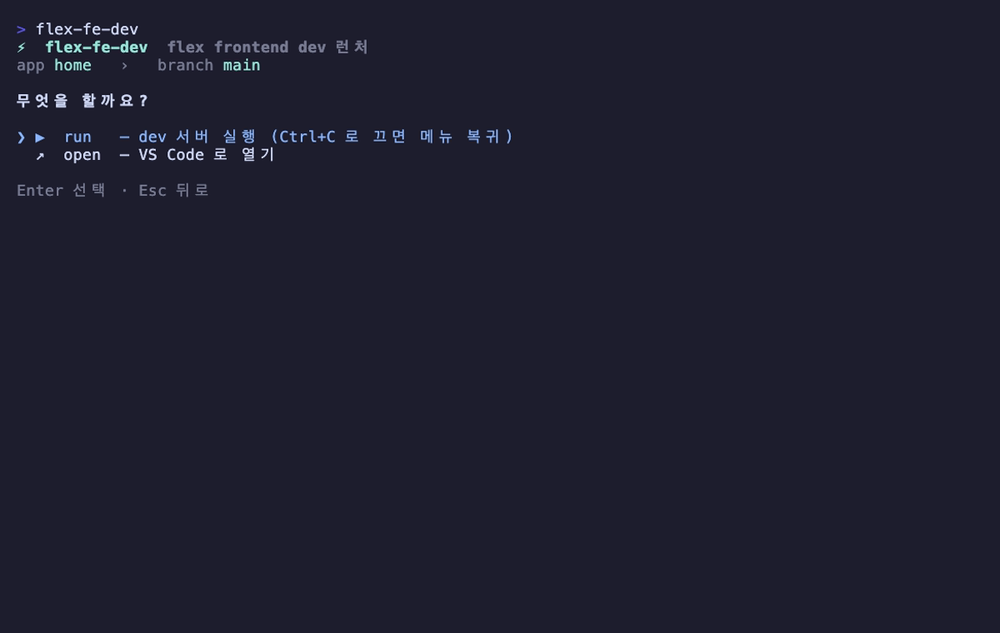

# flex-fe-dev-cli

> **[`flex-frontend-repositories`](https://github.com/flex-team/flex-frontend-repositories) 기반** — 부모 레포 아래 `flex-frontend*` submodule 들이 묶여 있고 각 submodule 에 `web-applications/{remotes-*, host}` 가 있는 모노레포 구조를 전제로 동작한다. 이 레이아웃이 아니면 앱 스캔이 비어 나온다.

flex frontend dev 런처. 작업할 **앱과 브랜치를 고르면** worktree 를 해석/생성하고, dev 서버를 띄우거나(`run`) VS Code 로 연다(`open`).

flex 프론트 레포는 부모 레포(`flex-frontend-repositories`) 아래 submodule 들로 묶여 있고, 작업은 각 submodule 의 worktree 에 격리한다. 이 도구는 그 흐름(앱 → 브랜치 → worktree → run/open)을 한 곳에서 처리한다.


## 설치

```bash
git clone git@github.com:flex-hyuntae/flex-fe-dev-cli.git
cd flex-fe-dev-cli
npm install
./install.sh
```

`install.sh` 는 두 가지를 한다:

1. `~/.local/bin` 에 `flex-fe-dev` 를 symlink (PATH 에 없으면 안내).
2. **`FLEX_ROOT` 를 한 번 묻는다** — flex 레포 루트(그 아래 `flex-frontend-repositories` 가 있는 디렉토리). 기본값은 `~/Projects/flex`, 폴더 구조가 다르면 그 자리에서 입력하면 된다. 값은 `~/.config/flex-fe-dev/config.json` 에 저장되며 셸 rc 는 건드리지 않는다. 나중에 바꾸려면 앱 화면에서 `Tab` → 설정으로 변경(저장 즉시 재스캔)하거나, `install.sh` 재실행 / env 오버라이드를 쓴다.

## 사용법 — `flex-fe-dev` (TUI)

```bash
flex-fe-dev
```

계속 떠 있는 대화형 런처. **앱 선택 → 브랜치 입력 → run/open** 순서로 진행한다.

### 1. 앱 선택

부모 레포 안 모든 submodule 의 `web-applications/{remotes-*, host}` 를 스캔해 **레포(submodule) 단위로 그룹핑**해 보여준다. 타이핑하면 **앱·레포 이름으로 즉시 필터링**된다. `host` 는 MF host 앱(`@flex-apps/host`)으로 다룬다.


검색 — `payroll` 입력 시 그 레포의 앱들만:


### 2. 브랜치 입력 → 3. run/open

브랜치를 입력하면 worktree 를 해석한다. **default branch 면 submodule 본체**를 그대로 쓰고, 그 외엔 체크아웃된 worktree 를 찾거나(없으면 origin 에서 자동 생성). 이어서 무엇을 할지 고른다.



- **run**: 기본적으로 **VS Code 로 해당 디렉토리를 먼저 열고**(분리 실행) — `Space` 로 이 옵션을 토글할 수 있다(기본 켜짐) — 이어서 `yarn install` → `.env.local` 보장 → `yarn turbo run dev --filter <workspace>` 를 foreground 로 실행. dev 를 `Ctrl+C` 로 끄면 프로그램이 종료되지 않고 **같은 앱의 브랜치 입력 단계로 복귀**한다 → 앱을 다시 고를 필요 없이 다른 브랜치를 바로 띄울 수 있다. **앱을 바꾸려면 브랜치 단계에서 `Esc`** 로 앱 선택으로 돌아간다.
- **open**: dev 없이 VS Code 로만 해당 디렉토리를 연다 (TUI 는 그대로 유지).

remote 를 run 하면 host(:3000) 의 `.env.local` 에서 그 remote 의 `MF_REMOTES_<NAME>_BASE_URL=http://localhost:<port>` 를 자동으로 활성화(주석 해제/없으면 추가)하고, dev 를 끄면 다시 주석 처리한다. `name`/`port` 는 각 remote 의 `mf.config.ts` 에서 읽는다. (host dev 서버가 이미 떠 있으면 변경 반영에 host 재시작이 필요할 수 있다.)

단축키: 앱 선택에서 **타이핑 검색** · `↑↓` 이동 · `Enter` 선택 · `Tab` 설정(FLEX_ROOT) · `Space` (액션 단계에서 VS Code 열기 토글) · `Esc` 뒤로(앱 단계에선 종료) · `Ctrl+C` 종료.

## 동작 규칙

| 입력 브랜치 | 결과 |
|---|---|
| default branch (예: `main`) | submodule 본체를 그대로 사용 (`/sync` 가 본체를 default 로 정렬하므로 곧 base 형상) |
| 체크아웃된 worktree 가 있는 브랜치 | 그 worktree 경로 |
| origin 에만 있는 브랜치 | `<submodule>/.claude/worktrees/<branch>/` 에 worktree 자동 생성 |
| origin 에도 없는 브랜치 | 에러 |

**host 특수 케이스**: host 는 도메인 remote 가 아니라 MF host 앱이라 `remotes-` 접두사 규칙을 따르지 않는다 → `@flex-apps/host` / `web-applications/host` 로 해석 (`src/core/apps.ts`).

## 환경변수

`FLEX_ROOT` 결정 우선순위: **env `FLEX_ROOT` → `~/.config/flex-fe-dev/config.json` (설치 시 또는 앱 내 `Tab` 설정에서 저장) → 기본값 `~/Projects/flex`**. env 는 항상 최우선이라 일시 오버라이드에 쓸 수 있다(이때는 설정에서 저장해도 즉시 반영되지 않는다).

| 변수 | 기본값 | 의미 |
|---|---|---|
| `FLEX_ROOT` | config 파일 → `$HOME/Projects/flex` | flex 레포들의 루트 |
| `FLEX_PARENT_REPO` | `$FLEX_ROOT/flex-frontend-repositories` | submodule 들이 묶인 부모 레포 |
| `XDG_CONFIG_HOME` | `$HOME/.config` | config 파일 위치의 베이스 |

## 구조

```
bin/flex-fe-dev      TUI 진입점 (node_modules/.bin/tsx src/cli.tsx — 빌드 없음)
src/cli.tsx          render + 메뉴↔dev 루프 (dev 종료 시 메뉴 복귀)
src/ui/App.tsx       앱 → 브랜치 → run/open 상태 머신
src/ui/FilterSelect.tsx  타이핑 검색 + 레포 그룹핑 + 스크롤 리스트
src/core/apps.ts     submodule 스캔 → AppInfo 목록 (레포 그룹/host 처리)
src/core/worktree.ts worktree 해석/자동 생성
src/core/actions.ts  run(dev) / open(code) / .env.local 보장
assets/demo.tape     스크린샷·GIF 캡처용 vhs tape
```

## 스크린샷 재생성

[vhs](https://github.com/charmbracelet/vhs) 로 `assets/` 의 GIF·PNG 를 다시 만든다.

```bash
brew install vhs          # 의존: ttyd, ffmpeg
cd assets && vhs demo.tape
```
